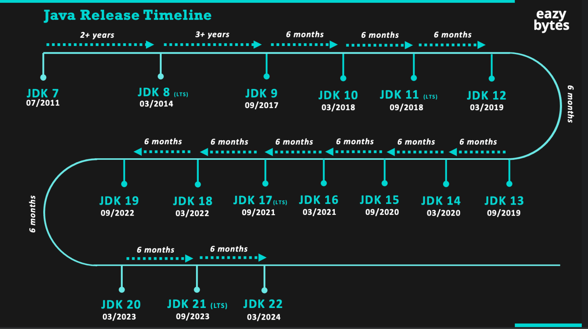

@author: Văn Minh Dương
@content: java basic

### WHAT IS JAVA?

- Java is a programming language that was developed by Sun Microsystems in the mid-1990s. It is now owned by Oracle Corporation.
- Java is a high-level, object-oriented programming language. It is a general-purpose programming language that is designed to have as few implementation dependencies as possible.
- Java is a class-based, object-oriented language. It is a general-purpose programming language that is designed to have as few implementation dependencies as possible.

<h1>Java brief history</h1>

- Java was developed by Sun Microsystems in the mid-1990s.
- 2004 java is the on top programming language in the world for the next 15 years.
- 2010 Oracle Corporation purchased Sun Microsystems. bringing Java to the next level.
- 2014 Java 8 was released and has some new features like lambda expression, streams, and annotations.
- 2017 Oracle announces its plant to release new version of Java.

<h1>Java keywords</h1>

| Keywords   | Description                                                                         |
|------------|-------------------------------------------------------------------------------------|
| abstract   | It is used to define an abstract class.                                             |
| assert     | It is used to check the condition and throw an exception if the condition is false. |
| boolean    | It is used to define a boolean data type.                                           |
| break      | It is used to break the loop.                                                       |
| byte       | It is used to define a byte data type.                                              |
| case       | It is used to define a case in a switch statement.                                  |
| catch      | It is used to catch an exception.                                                   |
| char       | It is used to define a char data type.                                              |
| class      | It is used to define a class.                                                       |
| const      | It is used to define a constant.                                                    |
| continue   | It is used to continue the loop.                                                    |
| default    | It is used to define a default case in a switch statement.                          |
| do         | It is used to define a do-while loop.                                               |
| double     | It is used to define a double data type.                                            |
| else       | It is used to define an else statement.                                             |
| enum       | It is used to define an enum.                                                       |
| extends    | It is used to extend a class.                                                       |
| final      | It is used to define a final variable.                                              |
| finally    | It is used to define a finally block.                                               |
| float      | It is used to define a float data type.                                             |
| for        | It is used to define a for loop.                                                    |
| goto       | It is used to define a goto statement.                                              |
| if         | It is used to define an if statement.                                               |
| implements | It is used to implement an interface.                                               |
| import     | It is used to import a class.                                                       |
| instanceof | It is used to check if an object is an instance of a class.                         |
| int        | It is used to define an int data type.                                              |
| interface  | It is used to define an interface.                                                  |
| long       | It is used to define a long data type.                                              |
| native     | It is used to define a native method.                                               |
| new        | It is used to create a new object.                                                  |    
| package    | It is used to define a package.                                                     |
| private    | It is used to define a private variable.                                            |
| protected  | It is used to define a protected variable.                                          |
| public     | It is used to define a public variable.                                             |    
| return     | It is used to return a value from a method.                                         |
| short      | It is used to define a short data type.                                             |
| static     | It is used to define a static variable.                                             | 

<h1>Application of Java</h1>

- Java is used to develop desktop, web, and mobile applications.
- Java is used to develop enterprise applications.
- Java is used to develop server-side applications.
- Java is used to develop mobile applications.
- Java is used to develop web applications.

