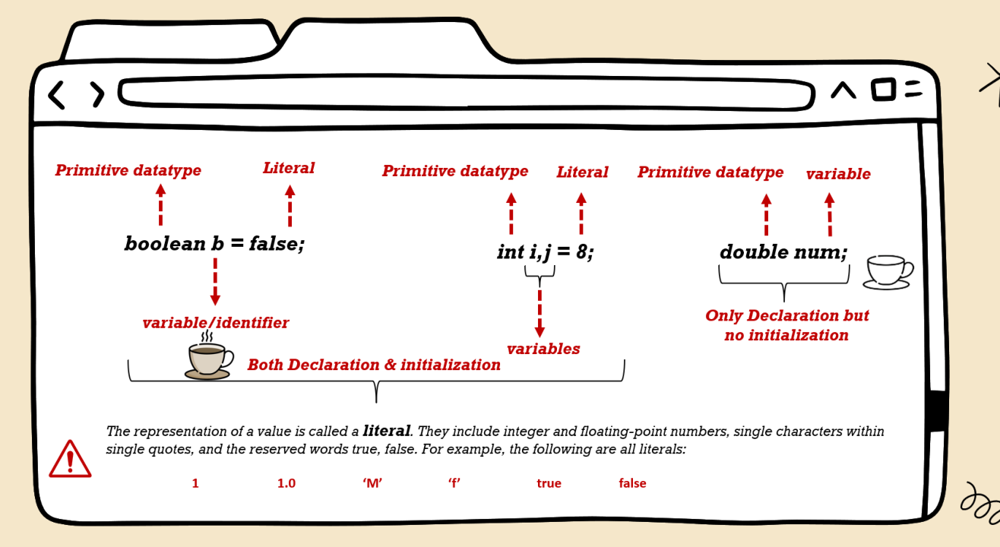
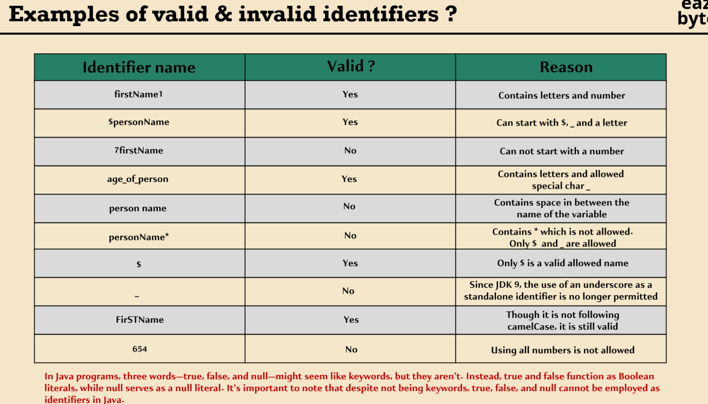
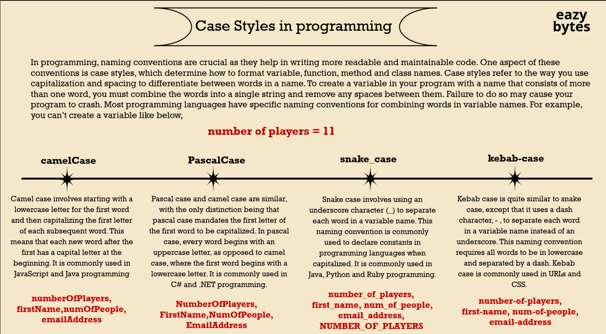

* có nhiều kiểu dữ liệu trong java:
  <br>
![[2] data-type in java_1.jpg](%5B2%5D%20data-type%20in%20java_1.jpg)

| Type              | Description             | Default | Size   | Exmaple Literal     | Range of value                                     |   
|-------------------|-------------------------|---------|--------|---------------------|----------------------------------------------------|
| Boolean           | True or False           | false   | 1 bit  | true, false         | True/ False                                        |  
| Byte              | two-complements Integer | 0       | 8 bit  | None                | [-128, 127]                                        |
| Unicode Character | Unicode character       | \u0000  | 16 bit | 'a', '\\', 'u0041'\ | character representation of ASCII values of  0 255 |   
| short             | two-complements Integer | 0       | 16 bit | none                | [-32768, 32767]                                    |
| int               | two-complements Integer | 0       | 32 bit | -2, 3, 4, 1         | [-2147483648, 2147483647]                          |   
| long              | two-complements Integer | 0       | 64 bit | -2L, 1L, 4L         | [-9223372036854775808, 9223372036854775807]        |   
| float             | IEEE 754 floating point | 0.0     | 32 bit | 1.3f, 5.675f        | upto 7 decimal digits                              |   
| double            | IEEE 754 floating point | 0.0     | 64 bit | -123456e-300d       | upto 7 decimal digits                              |   
|                   |                         |         |        |                     |                                                    |   
|                   |                         |         |        |                     |                                                    |   
* Kiểu dữ liệu không phải nguyên thủy:<br>
  String <br>
  Object <br>
  Class <br>
  Interface <br>
  Array<br>

## Sự khác nhau về biến nguyên thủy và biến không nguyên thủy
![[2] datatype in java.png](%5B2%5D%20datatype%20in%20java.png)

### Biến nguyên thủy và lớp bao bọc (Primitive data type and wrapped class)

| Primitive data type | Wrapped class |
|---------------------|---------------|
| char                | Character     |
| byte                | Byte          |
| short               | Short         |
| int                 | Integer       |
| long                | Long          |
| float               | Float         |
| double              | Double        |
| boolean             | Boolean       |
|                     |               |


<h5> Autoboxing and Unboxing trong java </h5>

<span> <b>Autoboxing</b></span>

<i> Việc chuyển đổi dữ liệu kiểu nguyên thủy thành lớp đối tượng bao bọc (Primitive -> Wrapped class)</i>
<br>

```java
// Java program to demonstrate Autoboxing

import java.util.ArrayList;
class Autoboxing {
	public static void main(String[] args)
	{
		char ch = 'a';

		// Autoboxing- primitive to Character object
		// conversion
		Character a = ch;

		ArrayList<Integer> arrayList
			= new ArrayList<Integer>();

		// Autoboxing because ArrayList stores only objects
		arrayList.add(25);

		// printing the values from object
		System.out.println(arrayList.get(0));
	}
}

```

<span> <b>Unboxing</b></span>

<i> Việc chuyển đổi ngược của quá trình Autoboxing, từ kiểu dữ liệu đối tượng bao bọc được chuyển thành kiểu dữ liệu nguyên thủy</i>
<br>

```java
// Java program to demonstrate Unboxing
import java.util.ArrayList;

class Unboxing {
	public static void main(String[] args)
	{
		Character ch = 'a';

		// unboxing - Character object to primitive
		// conversion
		char a = ch;

		ArrayList<Integer> arrayList
			= new ArrayList<Integer>();
		arrayList.add(24);

		// unboxing because get method returns an Integer
		// object
		int num = arrayList.get(0);

		// printing the values from primitive data types
		System.out.println(num);
	}
}

```

<h3>Syntax to declare primitive data type</h3>



```java


class PrimitiveDataType {
	public static void main(String[] args)
	{
		// syntax to declare primitive data type
		byte b = 4;
		short s = 5;
		int i = 6;
		long l = 7;
		float f = 8.0f;
		double d = 9.0d;
		boolean bool = true;
	}
}
```

<h3>Name a variable in java</h3>

 * bonus:
