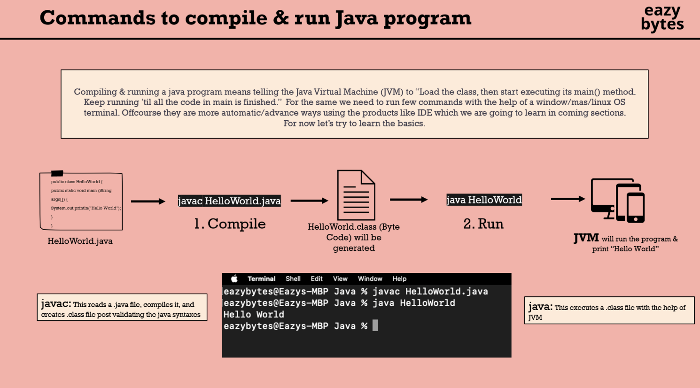

## MÔI TRƯỜNG THỰC THI JAVA

* source code (create a java source code file & write code with the help class of java and save file with the .java) ->  compile (using javac command the source code will be compiled and validated for any syntax errors. With the help  of JDK we can run javac command.) -> byte code(if the compilation successful, a new file wil be created witt .class. It contains byte code.) -> output code (JVM inside your machine will be read the byte code and translate same into OS (JVM = JDK, JRE + tools + library))
   

